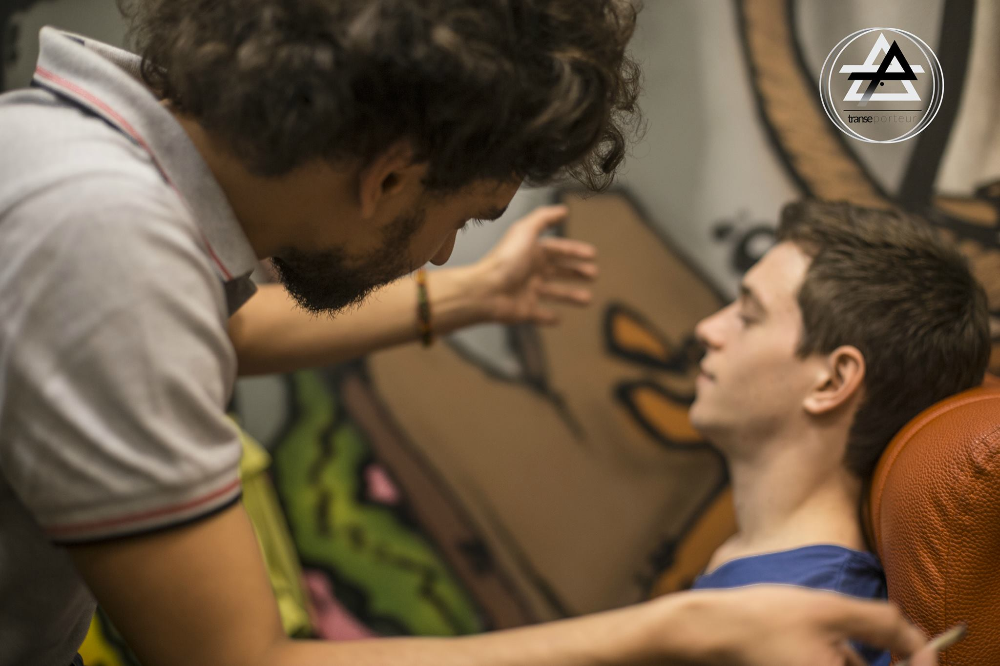
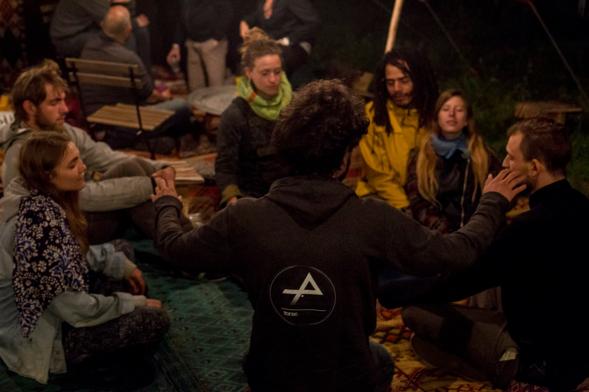

# TRANSE PORTEUR

Connectez-vous à vous-même et aux dimensions spirituelles avec **Transe Porteur** ...
Une **approche pragmatique, contemporaine et intuitive** des *Etats Modifiés de Conscience* mêlant **hypnose moderne, techniques chamaniques millénaires** et **neuro-thérapies innovantes**, avec une vision **psychonautique, introspective et expérimentale**.

## 🌟 Expériences, Psychonautisme et Transes Guidées
>  Atteignez des **États insolites, vivez d’incroyables expériences de voyage de l’esprit (*psychonautisme*)** et exploitez sensations, souvenirs et volonté avant, pendant et après. Je vous **accompagne** sobrement dans ces **réalités subtiles, ces dimensions atypiques**. De la **transe chamanique** - *qui vous connecte à vos totems, guides et symboles* - aux **Comas Hypnotiques** - *et leurs possibilités de reprogrammation, au plus profond, jusqu’à l’expression de gènes* -, ***je combine les voies vers ces extases intellectuelles, gnoses éclairées ou explorations abyssales.***

##  🙏 Coaching Mental & Entrainement en Transes
> Nous utilisons pendant la séance des nombreuses techniques de **remémoration, d’induction et d’approfondissement** pour atteindre un Etat Modifié de la Conscience et la Cognition personnalisé, selon vos objectifs et vos besoins … *Sieste récuperatrice, concentration et mémorisation, fluide esthétique, zone athlétique* : les exemples sont nombreux, et ces **transes du quotidien**, rares, souvent inopinées, vous ***deviennent accessibles, à la demande grâce à un systeme d’ancrage que je vous apprendrai.***

##  ⏳ Régressions, Futurisations & Vies Intérieures
> En induisant un **État Régressif**, qui permet un accès incroyable à la mémoire, aux souvenirs et la ligne du temps mentale, je vous permettrai de **revivre, revoir et extraire des informations** de votre passé - mais aussi d’un futur hypothétique déssiné par votre inconscient.
Pour la simple **exploration** ou pour **récupérer des capacités, informations** et sensations importantes, les régressions sont toujours des expériences fortes et enrichissantes. ***Plongez dans votre mémoire, et découvrez le futur possible de votre inconscient !***

##  🛠 Brain-Hacking & Optimisations Neuronales
> Avec des protocoles issus aussi bien de la **Programme Neuro-Linguistique** que de la **Magie du Chaos, du Yoga** - tantra en particulier -, et par la modélisation de façons innovantes et singulières de penser, traiter les perceptions, les informations … **je réactive par différents processus votre plasticité neuronale, autorisant l’intégration de structures cognitives nouvelles**. Des ressources et capacités insoupçonnées, comme découvrir de ***nouveaux sens, devenir multi-tâche et basculer une réflexion “en background”, lire photographiquement, changer sa vue ...***

# Vision & Engagement ✊

Avec une approche **pragmatique, contemporaine et intuitive** des *États Modifiés de Conscience*, je propose une utilisation intégrée dans le quotidien des Transes, dans un but **psychonautique : voyager dans l’esprit**, en tirer intuition, inspiration et meilleure connaissance de Soi. Proposer une élévation spirituelle, non-dogmatique, personnelle et ouverte. Les notions d'**expérimentation et d’experience** sont angulaires dans ma pratique.

Impliqué dans la *scène techno underground*, rave et alternative parisienne, vu comme le **shaman parmi les raveurs**, je propose, sensibilise et initie le public des soirées underground au psychonautisme, par des séances de **découverte de l'(auto-)hypnose**, l'experimentation de l'alteration de la conscience, de la cognition et de la percecption, et la meilleure connaissance de Soi qui en résulte. Membre actif de **LATERAL THINKING**, un collectif-label qui s’oriente vers les **“musiques pensantes plutôt que dansantes”**, l’ambient ou le drone et la musique experimentale après avoir organisées des “micro-raves” où parfois étaient mélées **musique, fête et hypnose.**

Convaincu que les Etats Modifiés de Conscience doivent être l'objet d'une *recherche underground* : osée dans ses méthodes, experimentale dans son essence, alternative dans sa vision, et libre dans ses entreprises ... **Je publie sur mon [Medium](https://medium.com/@TransePorteur/) observations, hypothèses et analyses** de mes sessions de recherche et d'experimentation.

# Parcours 📚
Passionné depuis toujours, j'**étudie, expérimente et améliore sa maîtrise des Etats Modifiés de Conscience, de Cognition et de Perception** et vois la transmission de mes connaissances comme une mission, en alliant **techniques millénaires** (*chamanisme, énergétique*) à **des outils modernes** (*hypnose, neuro-thérapies*), **méthodes mystiques** (*magie, tulpamancie*) et **technologies innovantes** (*neuro-feedback, stimulation sensorielle*).

**Formé à l’ARCHE à l’Hypnose Ericksonienne**, à la PNL et au RITMO (*technique mêlant EMDR et Hypnose*), **par Hype-N-Ose à l’Hypnose Elmanienne et aux transes H-Ultra** (*Coma Hypnotique, Hypnose Profonde*), **par Sobhi Levi à l'Énergétique** plus particulièrement au *Quantum Touch*, et **par Tamás Pataki au Reiki**. Mes nombreux échanges avec des praticiens aux techniques diverses, par des workshops, conférences et formations, je me suis enrichi d’une **multitude de techniques, méthodes**, aux inspirations variées.

# Contact 📬
Mes séances sont précédées d’un entretien par e-mail, testant la **motivation, clarifiant l’intention et préparant** aux séances à venir. Je me **déplace à domicile ou “in situ”**. 

La durée d’une séance est d’**environ 1h30**, mais peut - dans certains cas motivés - s’étendre sur plusieurs heures. 

Pour **plus d'informations** ou pour **prendre rendez-vous**, contactez-moi via **[la page Facebook "Transe Porteur"](https://fb.me/TransePorteur)** ou *[par mail](https://goo.gl/gjvi3s)*.

------

📍Actuellement à **Paris, France** ... ✈️ au **Havre, France** (*du 15 au 21 Juillet*) !

------

*Dernière MaJ : 12/07/2017 - © 2017 - Photos par [Blanche Clément](www.blancheclement.com)*
